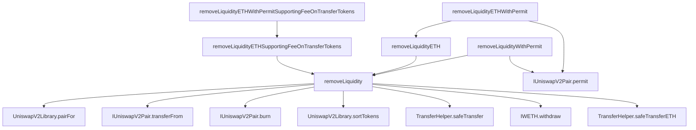

https://uni-sepolia.vercel.app/#/swap
# UdonSwap

UdonSwap is a decentralized exchange (DEX) protocol inspired by Uniswap, built on the Ethereum blockchain. It allows users to swap ERC-20 tokens without the need for intermediaries.

## Contract Structure

The UdonSwap protocol consists of two main parts:

### Core Contracts

The core part of the protocol handles its essential functions, like making and overseeing liquidity pools and enabling token exchanges. This core consists of the following three different contracts:

1. **Pair Contract**: Handles the liquidity pool and token swapping functionalities.
2. **Factory Contract**: Responsible for creating new pairs and initializing them.
3. **ERC20 Contract**: Represents the ERC-20 token standard contract for interacting with tokens on the Ethereum blockchain.

### Periphery Contracts

The periphery contracts in UdonSwap function as the interface layer for developers. While you can interact with the core contracts directly, it’s recommended to go through the periphery to avoid potential pitfalls. The periphery consists of the following contracts:

1. **UniswapV2Router01.sol**: This contract is an older version of the interface and is not recommended for use due to known issues.
2. **UniswapV2Router02.sol**: This contract is the newer and more reliable interface for interacting with UdonSwap. It simplifies the experience by hiding many of the complexities of direct core interaction.

## Contributing

Contributions to UdonSwap are welcome! Please follow the contribution guidelines and code of conduct.

## License

UdonSwap is licensed under the [MIT License](LICENSE).

## Disclaimer

UdonSwap is an experimental project and comes with no warranties or guarantees. Use it at your own risk.

## Contract Graph

